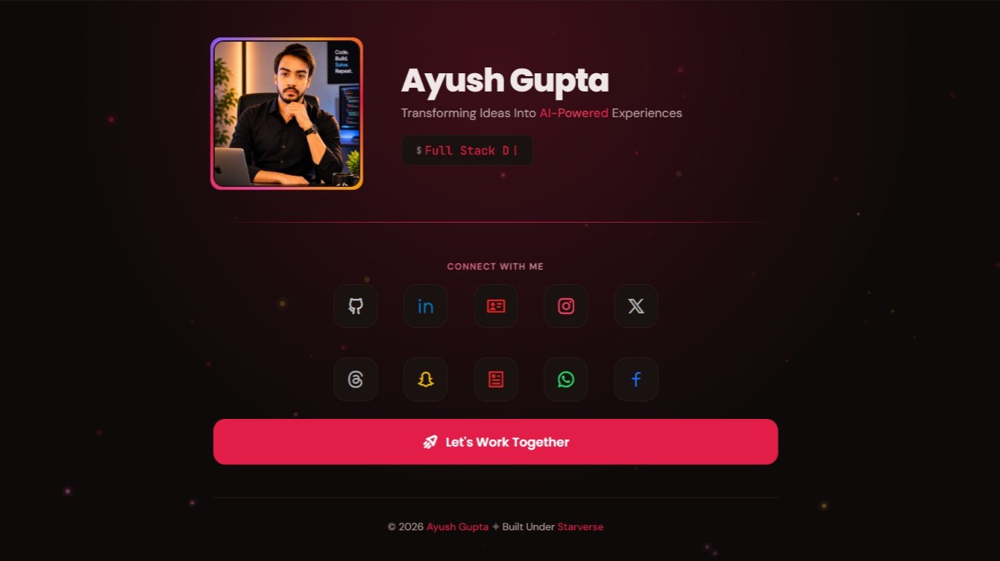
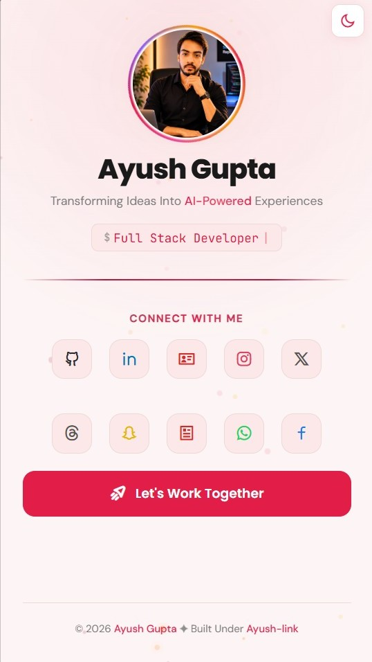

<div align="center">


# StarLink

**One link to connect with Ayush Gupta across 10+ platforms.**

<p align="center">
  <a href="https://starverse1130.github.io/Star-Link/" style="display: inline-block; padding: 14px 28px; background: #1a1a1a; color: #E11D48; border-radius: 12px; text-decoration: none; font-family: -apple-system, BlinkMacSystemFont, 'Segoe UI', Roboto, sans-serif; font-size: 1.1rem; font-weight: 600; border: 1.5px solid #E11D48; transition: all 0.2s ease;">
    🌐 starverse1130.github.io/Star-Link
  </a>
</p>

<p align="center">
  <a href="https://github.com/AyushEduverse/Ayush-Links">
    
  </a>
  
  
  
  
  
</p>

</div>

---

## Features

- **10 Social Links** — GitHub, LinkedIn, Portfolio, Instagram, X/Twitter, Threads, Snapchat, Resume, WhatsApp, Facebook
- **Animated Profile** — Rotating conic gradient ring with breathing glow
- **GSAP Entrance** — Staggered cinematic timeline on load
- **Dark/Light Mode** — Elastic burst reveal with system preference detection + localStorage persistence
- **Long-Press to Copy** — Direct clipboard copy with animated checkmark toast + haptic feedback
- **Smart Hire CTA** — Progress bar → "Opening Email..." feedback → prevents double-click
- **Touch Feedback** — Ripple effects, 3D avatar tilt, finger trail stars
- **PWA** — Installable, offline-ready with service worker caching

## Tech Stack

| Technology | Usage |
|:---|---:|
|  **HTML5** | Semantic page structure, PWA manifest, Open Graph meta tags, and SEO-friendly markup |
|  **CSS3** | Custom properties for light/dark theming, conic gradients for avatar ring, responsive breakpoints, and touch gesture styles |
|  **Vanilla JS** | Modular controller pattern with separate files for theme, animations, touch, and interactions — no frameworks, no build step |
|  **GSAP 3.12** | Cinematic staggered entrance on load, elastic burst clip-path for theme toggle, and GSAP-powered touch ripple effects |
|  **Typed.js 2.1** | Cycling typewriter effect for role titles with smart backspace and cursor |
|  **Remix Icons** | 10+ social brand icons, theme toggle moon/sun icons, and rocket ship icon for CTA button |
|  **Google Fonts** | Poppins for headings, DM Sans for body text, JetBrains Mono for typed terminal output |
|  **Service Worker** | Pre-caches all core assets on install, serves cached files offline with stale-while-revalidate background updates |

## Quick Start

```bash
git clone https://github.com/AyushEduverse/StarLink.git
cd StarLink
# Open index.html in browser — no build step needed
```

## Setup Guide

### 1. Replace Social Links
Edit `index.html` — update `href` on each `.social-icon-btn`:

```html
<a class="social-icon-btn" data-brand="github"
   href="https://github.com/YOUR_USERNAME"
   target="_blank" rel="noopener noreferrer"
   aria-label="GitHub — YOUR_USERNAME">
  <span class="tooltip">GitHub</span>
  <i class="ri-github-line"></i>
</a>
```

### 2. Update Profile
- Replace `assets/image/Aayush.webp` with your photo (128×128px, WebP)
- Update `alt` text in `` tag

### 3. Update Resume
- Replace `assets/pdf/Ayush_Resume.pdf` with your resume

### 4. Update Email & WhatsApp
- **Email:** Change `starverse1130@gmail.com` in `js/email.js` (the `to` variable) and the `href` in `.hire-cta`
- **WhatsApp:** Change phone number in `js/whatsapp.js` and `href` on `#whatsappBtn`

### 5. Update Typed Roles
Edit `js/typed.js`:

```js
strings: [
  'Your Role 1',
  'Your Role 2',
  'Your Role 3',
],
```

### 6. Customize Colors
Edit `css/variables.css` — change `--accent`, `--bg-primary`, etc. for both light and dark themes.

### 7. PWA Icons
Replace icons in `assets/icons/` (192×192, 512×512 PNG) and update `site.webmanifest`.

## Project Structure

```
├── index.html              ← Single-page entry point
├── sw.js                   ← Service worker (offline caching)
├── LICENSE                 ← MIT License
├── css/
│   ├── variables.css       ← CSS custom properties (light/dark)
│   ├── base.css            ← Reset, layout, utilities
│   ├── hero.css            ← Avatar ring, typography
│   ├── components.css      ← Social grid, tooltips, CTA, footer
│   ├── animations.css      ← Keyframes, reduced motion
│   ├── responsive.css      ← Breakpoints (360px → 1024px)
│   └── touch.css           ← Ripples, toast, touch gestures
├── js/
│   ├── init.js             ← Boots all controllers + SW registration
│   ├── theme.js            ← Dark/light toggle + clip-path reveal
│   ├── email.js            ← Pre-filled email + progress bar
│   ├── whatsapp.js         ← Pre-filled WhatsApp message
│   ├── gsap-entrance.js    ← Staggered entrance timeline
│   ├── typed.js            ← Typed.js role cycling
│   ├── stars.js            ← Floating particle canvas
│   ├── interactions.js     ← Magnetic hover, avatar tilt
│   └── touch.js            ← Ripples, long-press copy, haptics, trail
└── assets/
    ├── image/Aayush.webp   ← Profile image
    ├── pdf/Ayush_Resume.pdf
    ├── icons/              ← PWA icons + manifest
    └── screenshots/        ← PWA install screenshots
```

## Screenshots

<div align="center">
  <table>
    <tr>
      <td></td>
      <td></td>
    </tr>
  </table>
</div>

## PWA Offline

Service worker pre-caches all core assets on install. Cache-first strategy for local files, network-first for CDN. Works offline — navigation requests serve cached `index.html`.

- **Android (Chrome):** Visit → tap Install banner
- **Desktop (Chrome/Edge):** Click install icon in address bar
- **iOS (Safari):** Share → Add to Home Screen

## Accessibility (WCAG AA)

- `role="status"` + `aria-live="polite"` on toast for screen readers
- Skip-to-content link, semantic landmarks, `:focus-visible` on all controls
- `prefers-reduced-motion` respected on all animations
- All contrast ratios ≥ 4.5:1 across both themes
- `user-select: none` + `-webkit-touch-callout: none`
- Text uses `rem` units for proper scaling

---

## License

This project is licensed under the [MIT License](LICENSE) — © 2026 Ayush Gupta (Starverse).

---

<div align="center">
  <strong>Ayush Gupta</strong><br>
  Full Stack Developer · UI/UX Designer · Python Developer<br><br>
  <a href="https://github.com/AyushEduverse">GitHub</a> ·
  <a href="https://linkedin.com/in/ayushgupta1103">LinkedIn</a> ·
  <a href="https://x.com/ayushgupta1102">X</a> ·
  <a href="https://aayush.rf.gd">Portfolio</a>
  <br><br>
  Built with ❤️ under <strong>Starverse</strong>
</div>
